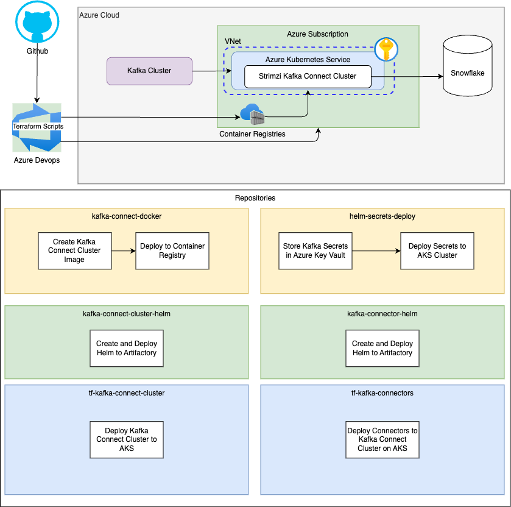

# strimzi-kakfa-connect-cluster
Collection of Code to Deploy Strimzi Kafka Connect Cluster

# Architecture

# CI/CD
CI/CD was managed by Azure Devops

# Code Repository
Code was stored in Github and CI/CD Pipelines were triggered from releases created from a main branch

## kafka-connect-docker
This was used to create the docker image that managed the Strimzi Operaters for creating the Kafka Connect Cluster

## kafka-secrets-docker
This image was used for deploying the kafka and snowflake secrets into the AKS cluster. This was mainly due to how kafka was implemented at client and how kafka certificates were managed.

## kafka-secrets-deploy
Helm chart to deploy the secrets to AKS from Key Vault

## tf-kafka-connect-cluster
Terraform for deploying the Strimzi Operator to the AKS Cluster and creating the Strimzi Kafka Connect Cluster

## kafka-connect-cluster-helm
Helm Chart for deploying the Strimzi Operator to the AKS Cluster

## tf-kafka-connectors
Terraform for deploying the kafka connectors and setting up the configuration for each connector

## kafka-connector-helm
Helm Chart for deploying the kafka connectors

